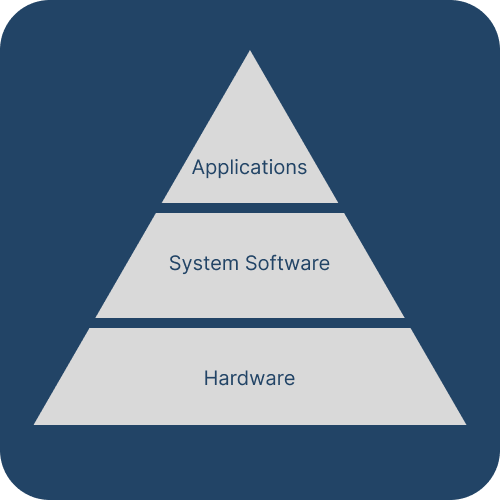
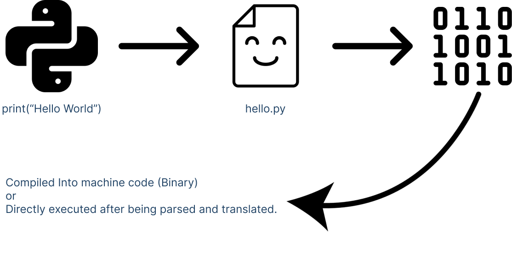

<!-- transition: swap 1s -->
# Open Source Software
### Ahmed Shuaib

---
<!-- transition: melt 1s -->

## What is
# Open Source Software

---
<!-- backgroundColor: #0d1117 -->
<!-- _color: #c8d0d9 -->

# Software
#### There are many types of software
- __Computer Applications__
- System software
- Utility software
### In technical terms...
- Set of __instructions__ that are __executed__ by the computer __hardware__.

---
<!-- transition: swap 1s -->
<!-- backgroundColor: #FFFFFF -->
<!-- _color: #224466 -->
# Open Source Software
#### Software that allows users todo __3__ important things with the __Source Code__.
- Study
- Modify
- Redistribute

---

# Source Code
#### Set of instructions for the computer to execute, however...
- Plain __human-readable__ text
- In the form of the __syntax__ for a programming __language__
#

---

# How does Source Code Work

---
# How does Open Source Software work
### Instead just of providing the binary or packaged files to the user.
### __Open Source__ software also provides public access to the __Source Code__.

---
# How does Open Source Software work
#### Licenses !!!
#### There are many types of the licenses.

- Premissive:
Contain very few restrictions as to how software can be used, modified, and redistributed.

- Copyleft:
Restrictive, the software can be modified and redistributed as long as the redistributed software is free and open source (FOSS) and under the same license.

---

# Proprietary:
Most restrictive, usually used for commercial or proprietary software. The software cannot be modified, or redistributed, such software is not open source. Many popular software companies use such licenses:

- Adobe
- Microsoft
- Google

---

<!-- transition: melt 1s -->
<!-- backgroundColor: #0d1117 -->
<!-- _color: #c8d0d9 -->
## What are the benefits of open-source?
Open-source software encourages collaboration and better organization.

Developers are more likely to: 

- Add and improve ideas and features in an application.
- Develop modular applications that support plugins, scripts, etc.

As anyone is allowed to view and manipulate the code of an application:

- Bugs and exploits are found much faster and tend to be patched much faster.
- Users can help find bugs and increase the accessibility of an application.

---
<!-- transition: swap 1s -->
<!-- backgroundColor: #0d1117 -->
<!-- _color: #c8d0d9 -->
## More benefits!
## Git:
- Centralized version control
- Manage branches and forks
- Merge developed features into main branch

## Consumer benefits:
- Up-to-date and latest features
- Secure
- Transparency
---
<!-- transition: swap 1s -->
<!-- backgroundColor: #0d1117 -->
<!-- _color: #c8d0d9 -->

I can go to Linus Torvalds Linux kernel repo and see what changes have been made today, what changes were made 2 months ago, who made them and why. [Here](https://github.com/torvalds/linux)

---
<!-- transition: swap 1s -->
<!-- backgroundColor: #0d1117 -->
<!-- _color: #c8d0d9 -->

Now imagine that this is the same base kernel that has been forked many times and is now running:
- Android phones
- TV's
- Routers/modems
- Home security systems

---

<!-- transition: melt 1s -->
<!-- backgroundColor: #FFFFFF -->
<!-- _color: #224466 -->
## Discussions
After talking to a few individuals about their thoughts on open-source software...
- Most people have no interest in the rules and restrictions that open-source software licenses have
- Most people just care about the end-user experience.

---
<!-- transition: melt 1s -->
<!-- backgroundColor: #0d1117 -->
<!-- _color: #c8d0d9 -->
## Conclusion
- Many people I talked to expressed their familiarity with using paid software like Windows, Photoshop, and Acrobat Reader.
- It is always nice to know that open-source software is there to fill in the gaps.
- Give open source software a try, you might find it a lot better.

#### My favorites:
- Arch Linux
- MPV
- Emacs
- LibreOffice

---
<!-- _color: #c8d0d9 -->
# Thank You :)
